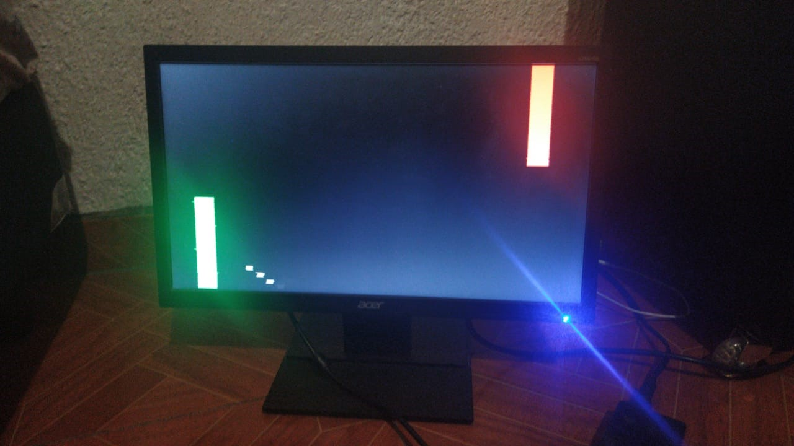
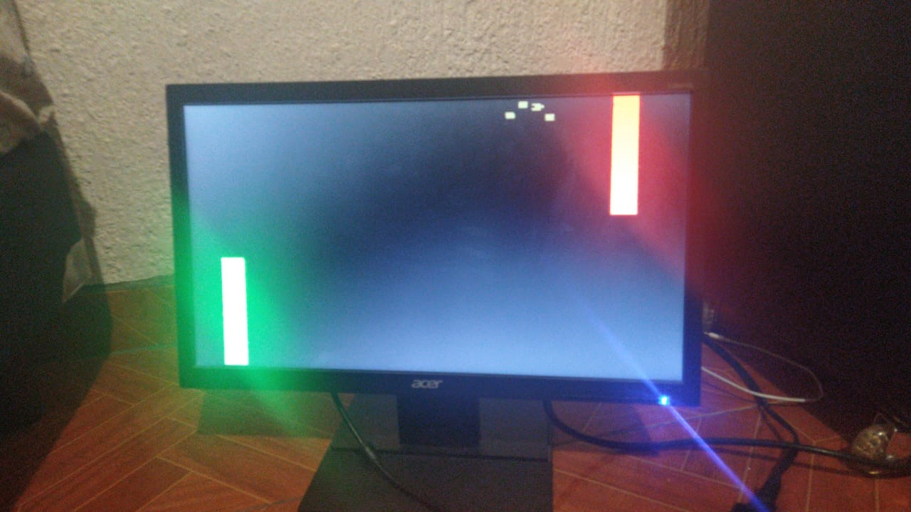
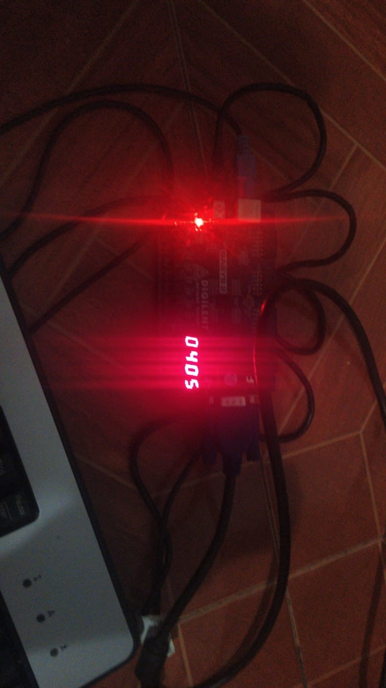
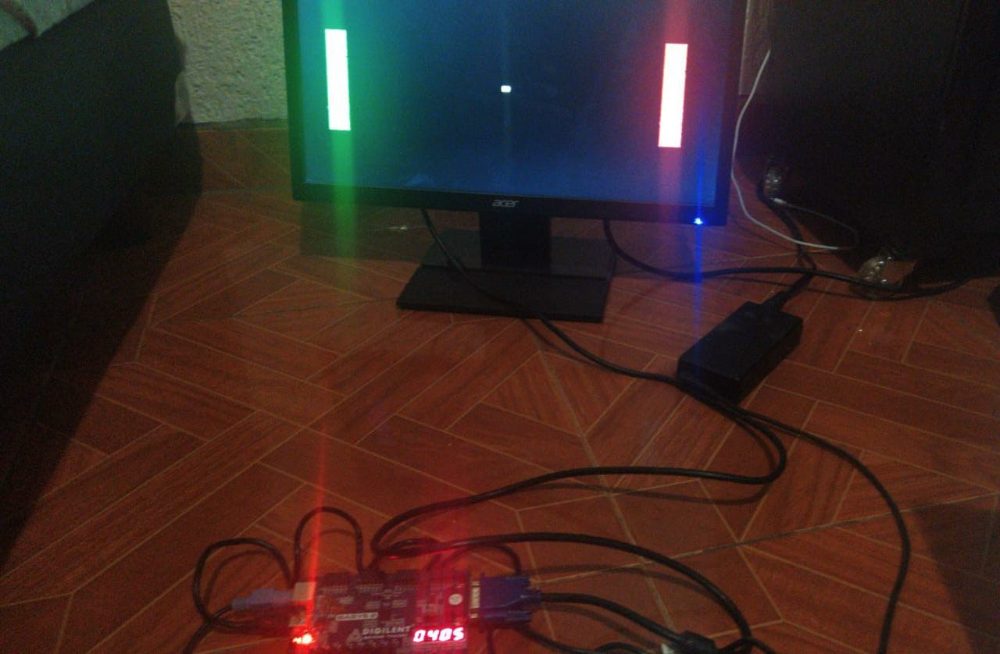
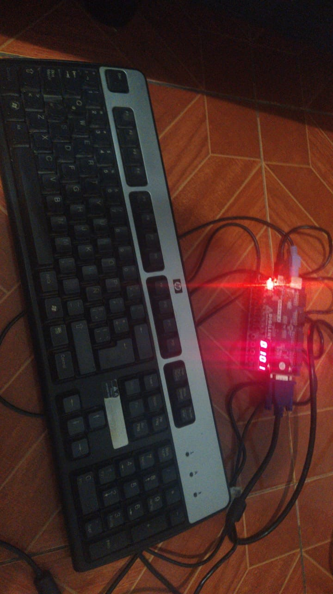

# Pong verilog
-----------
Juego de pong escritó en verilog para la tarjeta de desarrollo FPGA "Basys 2"

Es necesario contar con una pantalla VGA

Controles:

|Acción|Jugador1|Jugador2|
|-------|-------|------------|
|Subir|Tecla Windows derecha|Flecha arriba|
|Bajar|Tecla Windows izquierda|Flecha abajo|

Para reiniciar el juego se utiliza el segundo botón (de derecha a izquierda)

 ¡Diviertanse! 😊

